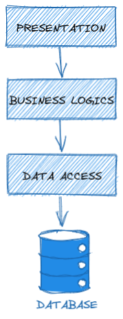
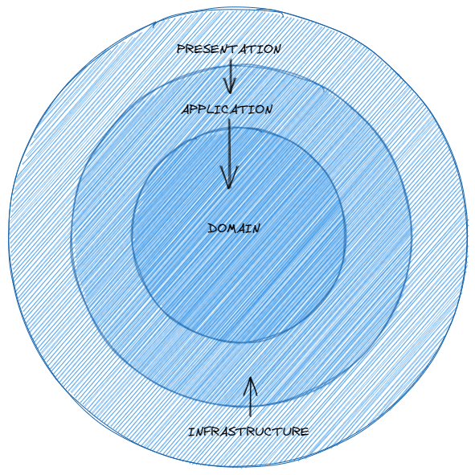

# 🦄 C# ASP.NET CORE 5 ONION ARCHITECTURE CQRS

[![Github][github-shield]][github-url]
[![Kofi][kofi-shield]][kofi-url]
[![LinkedIn][linkedin-shield]][linkedin-url]
[![Khanakat][khanakat-shield]][khanakat-url]

## TABLA DE CONTENIDO

* [Acerca del proyecto](#acerca-del-proyecto)
* [Instalación](#instalación)
* [Resumen teórico](#resumen-teórico)
* [Dependencias](#dependencias)
* [Licencia](#licencia)

## 🔥 ACERCA DEL PROYECTO

Este proyecto es una muestra de un esqueleto de aplicación con arquitectura de cebolla y patrón CQRS. Se utilizo ``ASP.NET Core 5`` con C#.

## ⚙️ INSTALACIÓN

Clonar el repositorio.

```bash
gh repo clone FernandoCalmet/DOTNET-5-ASPNET-Core-Onion-Architecture-CQRS
```

Ejecutar aplicación.

```bash
dotnet run
```

## 📓 RESUMEN TEÓRICO

### La Necesidad De Seguir Una Arquitectura

Para mantener la cordura estructural en soluciones medianas a grandes, siempre se recomienda seguir algún tipo de arquitectura. Debe haber visto que la mayoría de los proyectos de código abierto tienen múltiples capas de proyectos dentro de una estructura de carpetas compleja.

### Capa Vs Niveles

Cuando solo hay una separación lógica en su aplicación, podemos denominarla capas o N capas. En los casos en los que existe una separación física y lógica de preocupaciones, a menudo se la denomina aplicación de n niveles, donde n es el número de separaciones. 3 es el valor más común de N. En este proyecto se implementara la Arquitectura en capas.

Esta estratificación puede ayudar en la separación de preocupaciones, subdividiendo la solución en unidades más pequeñas para que cada unidad sea responsable de una tarea específica y también para aprovechar la abstracción. Para proyectos de escala media a grande donde trabajan varios equipos, las capas tienen ventajas muy obvias bajo la manga. Permite que un equipo o individuo específico trabaje en una capa en particular sin perturbar la integridad de los demás. Hace que sea mucho más fácil realizar un seguimiento de los cambios mediante el control de fuente.

Además, hace que toda su solución se vea limpia.

### Breve Descripción General De La Arquitectura De N-Layer

Una de las arquitecturas más populares en aplicaciones ASP.NET Core. Aquí hay una representación esquemática simple de una variación de la Arquitectura de N capas. La capa de presentación normalmente contiene la parte con la que el usuario puede interactuar, es decir, WebApi, MVC, formularios web, etc. La lógica empresarial es probablemente la parte más importante de toda esta configuración. Contiene todas las lógicas relacionadas con el requisito empresarial. Ahora, idealmente, cada aplicación tiene su propia base de datos dedicada. Para acceder a la base de datos, introducimos una capa de acceso a datos. Esta capa generalmente contiene ORM para que ASP.NET obtenga/escriba en la base de datos.



### Desventajas De La Arquitectura De N Capas

Para comprender claramente las ventajas de la arquitectura Onion en las aplicaciones ASP.NET Core, necesitaremos estudiar los problemas con la arquitectura N Layer. Es una de las arquitecturas de soluciones más utilizadas entre los desarrolladores de .NET.

En lugar de construir una estructura altamente desacoplada, a menudo terminamos con varias capas que dependen unas de otras. Esto es algo realmente malo en la creación de aplicaciones escalables y puede plantear problemas con el crecimiento de la base de código. Para dejarlo claro, en el diagrama anterior podemos ver que la capa de presentación depende de la capa de lógica, que a su vez depende del acceso a los datos y así sucesivamente.

Por lo tanto, estaríamos creando un montón de acoplamientos innecesarios. ¿Es realmente necesario? En la mayoría de los casos, la capa de interfaz de usuario (presentación) también se acoplaría a las capas de acceso a datos. Esto frustraría el propósito de tener una arquitectura limpia.

En la Arquitectura de N capas, la base de datos suele ser el núcleo de toda la aplicación, es decir, es la única capa que no tiene que depender de nada más. Cualquier pequeño cambio en la capa de lógica empresarial o en la capa de acceso a datos puede resultar peligroso para la integridad de toda la aplicación.

### Introducción A La Arquitectura Onion

La arquitectura Onion, presentada por Jeffrey Palermo, supera los problemas de la arquitectura en capas con gran facilidad. Con Onion Architecture, el cambio de juego es que la capa de dominio (entidades y reglas de validación que son comunes al caso comercial) está en el núcleo de toda la aplicación. Esto significa mayor flexibilidad y menor acoplamiento. En este enfoque, podemos ver que todas las capas dependen solo de las capas principales.



Así es como desglosaría la estructura de la Solución propuesta.

**La capa de dominio y aplicación** estará en el centro del diseño. Podemos referirnos a estas capas en Core Layers. Estas capas no dependerán de ninguna otra capa.

La capa de dominio generalmente contiene entidades y lógica empresarial. La capa de aplicación tendría interfaces y tipos. La principal diferencia es que la capa de dominio tendrá los tipos que son comunes a toda la empresa, por lo que también se puede compartir con otras soluciones. Pero la capa de aplicación tiene tipos e interfaces específicos de la aplicación. ¿Comprender?

Como se mencionó anteriormente, las capas principales nunca dependerán de ninguna otra capa. Por lo tanto, lo que hacemos es crear interfaces en la capa de aplicación y estas interfaces se implementan en las capas externas. Esto también se conoce como Principio de Inversión de Dependencia o DIP.

Por ejemplo, si su aplicación quiere enviar un correo, definimos un IMailService en la capa de aplicación y lo implementamos fuera de las capas principales. Con DIP, es posible cambiar fácilmente las implementaciones. Esto ayuda a crear aplicaciones escalables.

**La capa de presentación** es donde idealmente desearía colocar el proyecto al que el usuario puede acceder. Puede ser un proyecto WebApi, Mvc, etc.

**La capa de infraestructura** es un poco más complicada. Es donde le gustaría agregar su infraestructura. La infraestructura puede ser cualquier cosa. Tal vez una capa principal de Entity Framework para acceder a la base de datos, o una capa creada específicamente para generar tokens JWT para la autenticación o incluso una capa Hangfire. Comprenderá más cuando comencemos a implementar la arquitectura Onion en ASP.NET Core WebApi Project.

## 📥 DEPENDENCIAS

- [Swashbuckle.AspNetCore](https://www.nuget.org/packages/Swashbuckle.AspNetCore/) : Herramientas Swagger para documentar API creadas en ASP.NET Core.

## 📄 LICENCIA

Este proyecto está bajo la Licencia (Licencia MIT) - mire el archivo [LICENSE](LICENSE) para más detalles.

## ⭐️ DAME UNA ESTRELLA

Si esta Implementación le resultó útil o la utilizó en sus Proyectos, déle una estrella. ¡Gracias! O, si te sientes realmente generoso, [¡Apoye el proyecto con una pequeña contribución!](https://ko-fi.com/fernandocalmet).

<!--- reference style links --->
[github-shield]: https://img.shields.io/badge/-@fernandocalmet-%23181717?style=flat-square&logo=github
[github-url]: https://github.com/fernandocalmet
[kofi-shield]: https://img.shields.io/badge/-@fernandocalmet-%231DA1F2?style=flat-square&logo=kofi&logoColor=ff5f5f
[kofi-url]: https://ko-fi.com/fernandocalmet
[linkedin-shield]: https://img.shields.io/badge/-fernandocalmet-blue?style=flat-square&logo=Linkedin&logoColor=white&link=https://www.linkedin.com/in/fernandocalmet
[linkedin-url]: https://www.linkedin.com/in/fernandocalmet
[khanakat-shield]: https://img.shields.io/badge/khanakat.com-brightgreen?style=flat-square
[khanakat-url]: https://khanakat.com